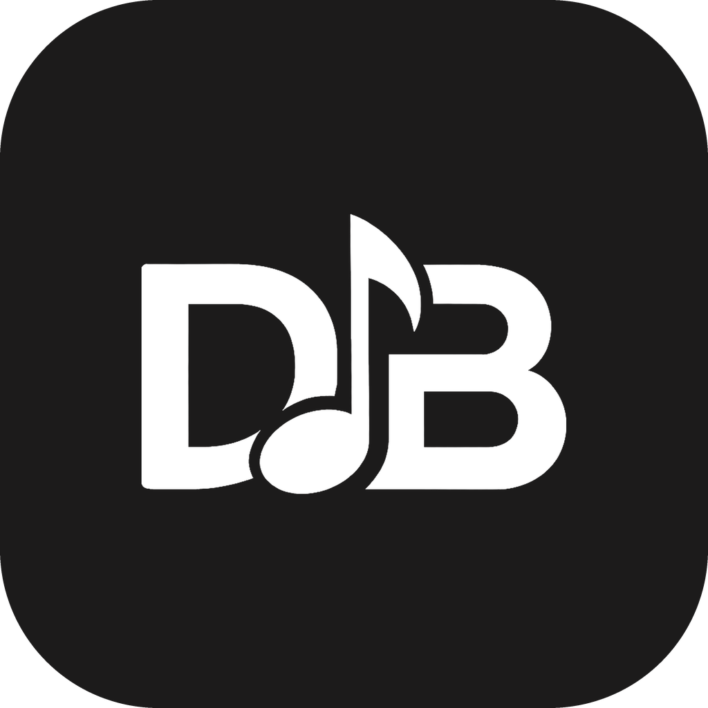

<p align="center">
  
</p>

<h1 align="center">🥁 DeskBeat</h1>

<p align="center"><b>Turn your MacBook into a tactile drum machine.</b></p>

DeskBeat is a native macOS menu-bar app that reads your laptop's built-in accelerometer to detect physical taps on the chassis (or the desk right next to it) and triggers drum samples — no MIDI controller, no microphone, just your hands and your Mac.

> **Honest heads-up:** this is an experimental, fun project, not a precision instrument. The accelerometer is a great party trick and a fun way to bang out a simple beat, but it is **not** a replacement for real finger-drumming hardware. See [Limitations](#-honest-limitations) before you expect studio-grade timing. It is now **100% open source and free** — no license keys, no paywall.

---

## ✨ What it does

- **Standard mode** — real-time triggering. Tap the top/palm-rest area for one sound, the side of the chassis for another. Includes an *Invert sides* option for lefties.
- **Looper mode** — tap a rhythm, DeskBeat estimates the BPM and quantizes it onto a 16-step / 1-bar grid, then loops it. Switch pads to layer more instruments.
- **Custom sounds** — import your own `.wav` / `.mp3` samples in Settings; they become playable pads.
- **Adjustable sensitivity** — 5 levels, from "heavy hits only" to "light fingertips".
- **Battery friendly** — the accelerometer is only woken while the popover is open (or when *Play in background* is enabled).

## 🧠 How it works

Apple Silicon MacBooks contain an undocumented MEMS accelerometer (a Bosch IMU) exposed through the private `AppleSPUHIDDriver` IOKit interface. DeskBeat:

1. Wakes the sensor to ~100 Hz via `IORegistryEntrySetCFProperty`.
2. Reads raw HID reports and parses the X/Z axes (`int32`, little-endian, scaled by `1/65536`).
3. Low-pass filters out gravity to get linear acceleration, then computes **jerk** (its derivative).
4. Fires a trigger when peak jerk crosses the sensitivity threshold, with a 110 ms lock-out to suppress double hits.
5. Classifies the hit as **TOP** vs **SIDE** from the ratio of lateral to vertical jerk.

Audio is played through `AVAudioEngine` (`AVAudioUnitSampler` → compressor → peak limiter).

This relies on a **private, undocumented API**. Prior reverse-engineering work that documents the same interface: [olvvier/apple-silicon-accelerometer](https://github.com/olvvier/apple-silicon-accelerometer) and [taigrr/apple-silicon-accelerometer](https://github.com/taigrr/apple-silicon-accelerometer). Thanks to them.

---

## 🛠 Requirements

- **Apple Silicon MacBook** (M1 or newer). ⚠️ Mac **desktops** (mini, iMac, Studio, Pro) have no accelerometer and are **not supported**. Intel Macs do not expose the sensor to apps.
- **macOS 14 (Sonoma) or later**
- **Xcode 15+** / Swift 5.9+ to build
- **App Sandbox must be OFF** — direct access to the private HID sensor is blocked by the sandbox. The bundled [`DeskBeat.entitlements`](DeskBeat.entitlements) already sets `com.apple.security.app-sandbox` to `false`.

## 🚀 Build & run

The fastest way, from this directory:

```bash
swift run DeskBeat
```

A 🥁 icon appears in your menu bar. Click it to open the app.

Or in Xcode:

1. Open `Package.swift`.
2. Select the **DeskBeat** scheme.
3. (If signing) set your Development Team and keep **App Sandbox disabled** under *Signing & Capabilities*.
4. Press **⌘R**.

### Building a distributable `.app` / DMG

A helper script is included:

```bash
./build_dmg.sh
```

Note: to share the app with others without Gatekeeper warnings you need an Apple **Developer ID** and **notarization**. Because the app is un-sandboxed, it **cannot** be distributed on the Mac App Store.

---

## 🎮 How to play

1. Put your MacBook on a **stable, solid desk** (flimsy/bouncy surfaces hurt detection).
2. **Standard mode:** tap the palm-rest area and the side of the chassis. Tune the sensitivity slider until taps register cleanly.
3. **Looper mode:** pick a pad, tap a steady rhythm, pause — DeskBeat detects the tempo and loops it. Switch pads to layer instruments.
4. **Custom kits:** Settings → *Add Sounds* to import your own samples.

---

## ⚠️ Honest limitations

These are inherent to using a vibration sensor as a drum trigger — worth knowing before judging it:

- **Timing isn't sample-accurate.** The looper sequencer runs on a main-thread timer, so loops can drift/jitter under load. Don't expect a tight studio grid.
- **~110 ms lock-out** caps you at roughly 9 hits/second — fast rolls and double-strokes won't register.
- **Only two zones** (TOP/SIDE), distinguished by a simple heuristic — not a full pad layout.
- **Surface-dependent.** Hit too hard → double triggers; too soft → nothing. The right surface + a bit of practice make a big difference.
- **Private API.** A future macOS update could change the HID report layout and break detection.

---

## 🗂 Architecture

| File | Responsibility |
|---|---|
| `DeskBeatApp.swift` | App lifecycle, menu-bar entry point, tap → sound routing |
| `MotionManager.swift` | IOKit HID access, sensor wake/sleep, jerk-based tap detection |
| `AudioEngineManager.swift` | `AVAudioEngine` setup, sample loading, custom-sound import |
| `LooperManager.swift` | BPM estimation, quantization, 16-step sequencer playback |
| `ContentView.swift` | Layout router between Standard / Looper / Settings |
| `StandardModeView.swift` · `LooperModeView.swift` · `SettingsView.swift` · `OnboardingView.swift` | UI screens |
| `DeskBeatComponents.swift` | Reusable UI components (drum pads, rows) |

---

## 📜 License

MIT — see [LICENSE](LICENSE). Built by Angelo Quartarone. Contributions and forks welcome.
